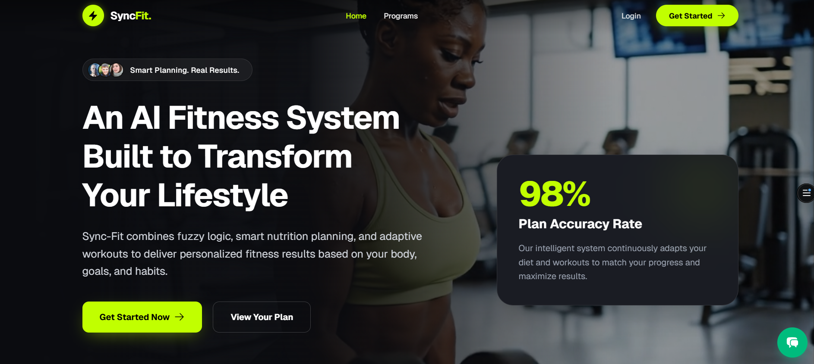
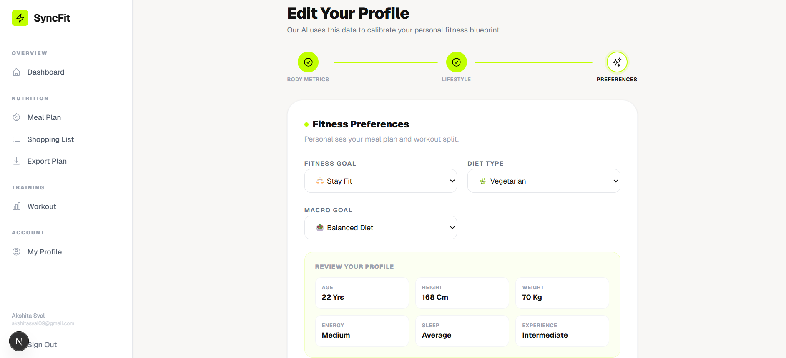

# Sync-Fit

A full-stack fitness web application that provides personalized **meal plans, workout programs, and shopping lists** based on user goals, diet preferences, and lifestyle. Sync-Fit combines nutrition and fitness into a single intelligent platform.



---

## 🚀 Features

* User Authentication (Login / Register)
* Personalized Profile Setup (body metrics, goals, diet)
* Meal Plan Generation (vegan, vegetarian, non-vegetarian)
* Fasting Mode with dedicated meal plans
* Automated Shopping List (based on meal plan)
* Program-based Workout System
* Dashboard with daily fitness insights
* Clean and modern responsive UI
* Secure backend with structured APIs

---

# 🧠 Core Modules (Detailed)

## 🍽 Meals System

Handles intelligent meal planning based on user diet preferences.

**Features:**

* Supports vegan, vegetarian, and non-vegetarian diets
* Strict diet filtering (no incorrect meal leakage)
* Category-based meals (breakfast, lunch, dinner)
* Fasting meal support
* Nutritional data (calories, protein, carbs, fats)

**Logic:**

* Filters meals using `dietType`
* Applies optional filters (calories, tags)
* Generates weekly meal plans

---

## 🏋️ Workout System

Provides structured fitness programs based on user goals.

**Features:**

* Program-based workouts:

  * Strength Training
  * Weight Loss
  * Cardio & Endurance
  * Muscle Gain
  * Beginner Plans
* Exercises with sets, reps, and duration
* Difficulty levels (beginner → advanced)

**Logic:**

* Maps user fitness goals to workout programs
* Generates daily/weekly workout plans

---

## 🛒 Shopping List System

Automatically generates grocery lists from meal plans.

**Features:**

* Extracts ingredients from meals
* Combines duplicate items
* Updates list on every meal plan change
* Linked to user profile

**Logic:**

* Runs after meal plan generation
* Groups and deduplicates ingredients

---

## 👤 Profile System

Stores and manages user data for personalization.



**Features:**

* One-time setup (no repeated input)
* Stores:

  * Age, weight, height
  * Fitness goal
  * Diet preference
* Editable anytime

**Logic:**

* Auto-fetches profile on login
* Drives meal + workout recommendations

---

## 🥗 Fasting System

Handles fasting-specific meal plans.

**Features:**

* Toggle-based fasting mode
* Dedicated fasting meals (sabudana, fruits, etc.)
* Separate filtering logic

**Logic:**

* If `isFasting = true`:

  * Only fasting meals are used
* Syncs with shopping list

---

## 📊 Dashboard System

Central hub for user activity and insights.

**Features:**

* Displays:

  * Today’s meals
  * Workout plan
  * Shopping list
* Fasting toggle control
* Clean card-based UI

---

## 🔐 Authentication System

Manages user login and session handling.

**Features:**

* Secure login/register
* Session management with NextAuth
* Protected routes

---

## 🛠 Tech Stack

### Frontend

* Next.js (App Router)
* React.js
* Tailwind CSS

### Backend

* Node.js
* Next.js API Routes

### Database

* MongoDB
* Mongoose

### Other Tools

* NextAuth (Authentication)
* Axios / Fetch API

---

## 📁 Project Structure

```
Sync-Fit
│
├── src
│   ├── app
│   │   ├── dashboard
│   │   ├── api
│   │   └── layout.tsx
│   │
│   ├── components
│   │   ├── ui
│   │   ├── cards
│   │   └── forms
│   │
│   ├── modules
│   │   ├── meals
│   │   ├── workouts
│   │   ├── profile
│   │   ├── shopping-list
│   │   └── fasting
│   │
│   ├── models
│   │   ├── Meal.ts
│   │   ├── Workout.ts
│   │   ├── User.ts
│   │   └── ShoppingList.ts
│   │
│   ├── lib
│   │   ├── mongodb.ts
│   │   └── utils.ts
│   │
│   └── styles
│       └── globals.css
│
├── scripts
│   ├── seedMeals.ts
│   └── seedWorkouts.ts
│
├── public
│   └── images
│
├── package.json
└── README.md
```

---

## ⚙️ Installation

### 1. Clone the repository

```
git clone https://github.com/akshitasyal/Sync-Fit.git
```

### 2. Navigate to the project folder

```
cd Sync-Fit
```

### 3. Install dependencies

```
npm install
```

### 4. Setup environment variables

```
MONGODB_URI=your_mongodb_connection_string
NEXTAUTH_SECRET=your_secret_key
NEXTAUTH_URL=http://localhost:3000
```

---

### 5. Run the development server

```
npm run dev
```

---

## 🧪 Seed Data

```
npx ts-node scripts/seedMeals.ts
npx ts-node scripts/seedWorkouts.ts
```

---

## 🔥 Future Improvements

* AI-based meal recommendations
* Smart calorie tracking
* Real-time analytics
* Mobile app version
* Notifications & reminders

---

## 👩‍💻 Author

**Akshita Syal**
GitHub: https://github.com/akshitasyal

---

⭐ If you like this project, feel free to star the repository!
