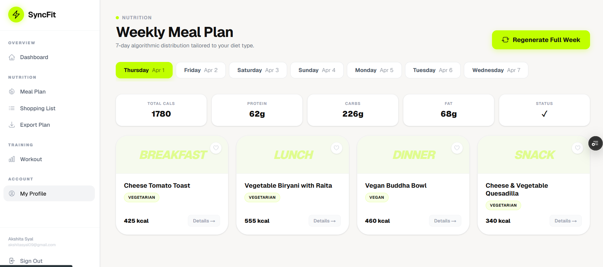
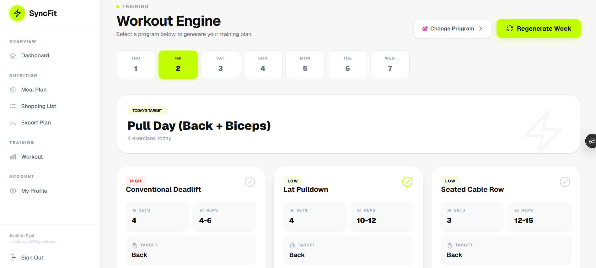
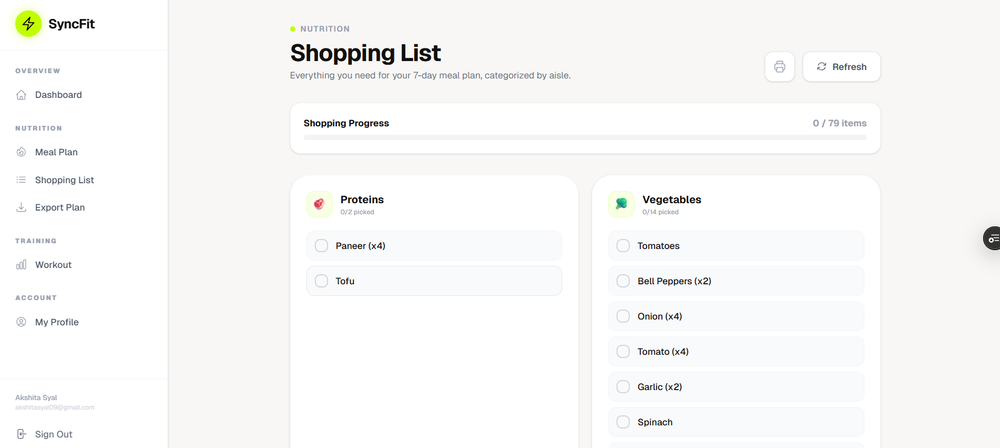
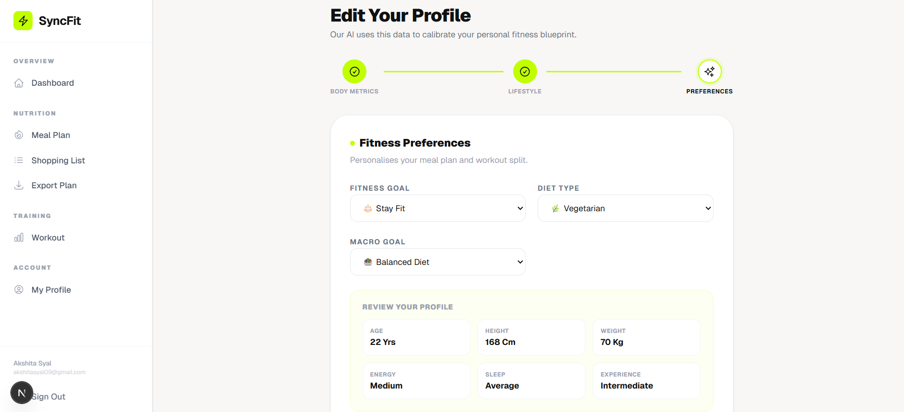
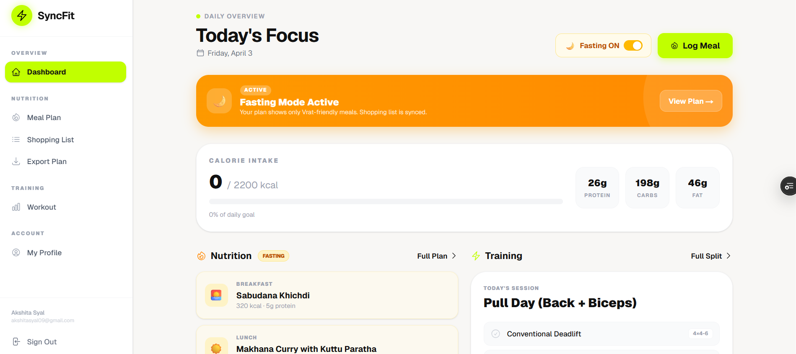
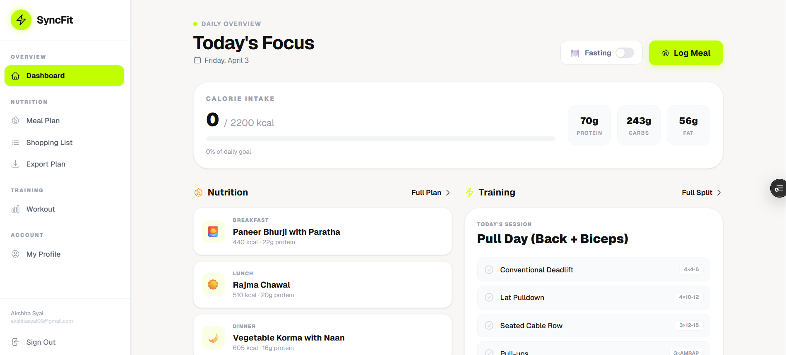

# SyncFit ⚡

A modern, full-stack fitness and nutrition platform built with **Next.js 16 (App Router), React 19, TypeScript, Tailwind CSS, MongoDB, and NextAuth**. SyncFit pairs personalized workout generation and biomechanical exercise movement loops with intelligent meal planning and automated grocery list aggregation.

---

## ✨ Core Features

### 🏋️ Workout Engine & Biomechanical Video Guides
* **Personalized Training Programs:** Strength, Hypertrophy (Muscle Gain), Cardio & Endurance, Weight Loss, Beginner, and Adaptive tracks.
* **Exercise Video Demonstrations:** Distinct looping biomechanical movement animations for 42+ exercises (Leg Press, Glute Bridge, Power Clean, Pull-ups, Lat Pulldown, Incline Dumbbell Press, etc.).
* **Technique & Form Guide:** Step-by-step numbered instructions, optimal form cues (`✓`), common mistakes (`×`), breathing rhythm, and tempo guidance.
* **Active Workout Mode:** Guided real-time session tracker with set logging, countdown timers, and progressive overload targets.

### 📊 Body Composition & Fitness Blueprint
* **Biometric Calculations:** Calculates BMI, BMI category, Daily Calorie Estimates (TDEE/BMR), and Daily Water Intake targets.
* **Personalized Direction:** Directs users towards specific fitness pathways (*Fat Loss*, *Hypertrophy*, *Recomposition*, *Endurance*) with tailored blueprint summaries.

### 🥗 Nutrition & Intelligent Meal Planning
* **Dietary Profiles:** Strict filtering for Vegan, Vegetarian, and Non-Vegetarian nutrition.
* **Fasting Mode:** Dedicated intermittent and spiritual fasting meal plans.
* **Macro & Micronutrient Tracking:** Real-time breakdown of Calories, Protein, Carbohydrates, and Fats.

### 🛒 Automated Shopping List
* Automatically extracts and aggregates grocery ingredients from active meal plans with instant deduplication.

---

## 🛠️ Tech Stack

<<<<<<< HEAD
##  Meals System

Handles intelligent meal planning based on user diet preferences.



**Features:**

* Supports vegan, vegetarian, and non-vegetarian diets
* Strict diet filtering (no incorrect meal leakage)
* Category-based meals (breakfast, lunch, dinner)
* Fasting meal support
* Nutritional data (calories, protein, carbs, fats)

**Logic:**

* Filters meals using `dietType`
* Applies optional filters (calories, tags)
* Generates weekly meal plans
=======
* **Framework:** [Next.js 16](https://nextjs.org/) (App Router, Server Actions & Route Handlers)
* **Frontend Library:** [React 19](https://react.dev/)
* **Styling:** [Tailwind CSS](https://tailwindcss.com/)
* **Language:** [TypeScript](https://www.typescriptlang.org/)
* **Database & ODM:** [MongoDB](https://www.mongodb.com/) via [Mongoose](https://mongoosejs.com/)
* **Authentication:** [NextAuth.js](https://next-auth.js.org/) (JWT Strategy)
* **Icons:** [@heroicons/react](https://heroicons.com/)
>>>>>>> b6e10d4 (upgraded workout engine)

---

## 🚀 Getting Started

<<<<<<< HEAD
Provides structured fitness programs based on user goals.



**Features:**

* Program-based workouts:

  * Strength Training
  * Weight Loss
  * Cardio & Endurance
  * Muscle Gain
  * Beginner Plans
* Exercises with sets, reps, and duration
* Difficulty levels (beginner → advanced)

**Logic:**

* Maps user fitness goals to workout programs
* Generates daily/weekly workout plans

---

##  Shopping List System

Automatically generates grocery lists from meal plans.



**Features:**

* Extracts ingredients from meals
* Combines duplicate items
* Updates list on every meal plan change
* Linked to user profile

**Logic:**

* Runs after meal plan generation
* Groups and deduplicates ingredients

---

##  Profile System

Stores and manages user data for personalization.



**Features:**

* One-time setup (no repeated input)
* Stores:

  * Age, weight, height
  * Fitness goal
  * Diet preference
* Editable anytime

**Logic:**

* Auto-fetches profile on login
* Drives meal + workout recommendations

---

##  Fasting System

Handles fasting-specific meal plans.



**Features:**

* Toggle-based fasting mode
* Dedicated fasting meals (sabudana, fruits, etc.)
* Separate filtering logic

**Logic:**

* If `isFasting = true`:

  * Only fasting meals are used
* Syncs with shopping list

---

##  Dashboard System

Central hub for user activity and insights.



**Features:**

* Displays:

  * Today’s meals
  * Workout plan
  * Shopping list
* Fasting toggle control
* Clean card-based UI

---

##  Authentication System

Manages user login and session handling.

**Features:**

* Secure login/register
* Session management with NextAuth
* Protected routes

---

##  Tech Stack

### Frontend

* Next.js (App Router)
* React.js
* Tailwind CSS

### Backend

* Node.js
* Next.js API Routes

### Database

* MongoDB
* Mongoose

### Other Tools

* NextAuth (Authentication)
* Axios / Fetch API

---

##  Project Structure

```
Sync-Fit
│
├── src
│   ├── app
│   │   ├── dashboard
│   │   ├── api
│   │   └── layout.tsx
│   │
│   ├── components
│   │   ├── ui
│   │   ├── cards
│   │   └── forms
│   │
│   ├── modules
│   │   ├── meals
│   │   ├── workouts
│   │   ├── profile
│   │   ├── shopping-list
│   │   └── fasting
│   │
│   ├── models
│   │   ├── Meal.ts
│   │   ├── Workout.ts
│   │   ├── User.ts
│   │   └── ShoppingList.ts
│   │
│   ├── lib
│   │   ├── mongodb.ts
│   │   └── utils.ts
│   │
│   └── styles
│       └── globals.css
│
├── scripts
│   ├── seedMeals.ts
│   └── seedWorkouts.ts
│
├── public
│   └── images
│
├── package.json
└── README.md
```

---

## ⚙️ Installation

### 1. Clone the repository

```
=======
### 1. Clone the Repository
```bash
>>>>>>> b6e10d4 (upgraded workout engine)
git clone https://github.com/akshitasyal/Sync-Fit.git
cd Sync-Fit
```

### 2. Install Dependencies
```bash
npm install
```

### 3. Configure Environment Variables
Copy the example environment file:
```bash
cp .env.example .env.local
```

Open `.env.local` and add your local configuration:
```env
# Application
NEXT_PUBLIC_APP_URL="http://localhost:3000"

# MongoDB Database Connection
MONGODB_URI="mongodb+srv://<username>:<password>@<cluster-url>.mongodb.net/syncfit?retryWrites=true&w=majority"

# NextAuth Configuration
NEXTAUTH_URL="http://localhost:3000"
NEXTAUTH_SECRET="your_nextauth_secret_key_change_in_production"
```

### 4. Run Development Server
```bash
npm run dev
```
Open [http://localhost:3000](http://localhost:3000) in your browser.

---

## 📦 Production Build & Testing

Verify TypeScript and create an optimized production build:
```bash
# Type check
npm run type-check   # or: npx tsc --noEmit

# Production build
npm run build

# Start production server
npm run start
```

---

## 🔒 Security & Privacy

* **Zero Hardcoded Secrets:** All database strings, JWT keys, and credentials are exclusively read from server-side environment variables.
* **Protected Routes:** Next.js Route Protection and NextAuth Middleware ensure authenticated access to workouts, profile, and meal planning data.
* **Safe Configuration:** `.env` and `.env.local` are strictly excluded from version control via `.gitignore`.

---

## 📄 License & Attribution

SyncFit is maintained by [Akshita Syal](https://github.com/akshitasyal). Distributed under the MIT License.
